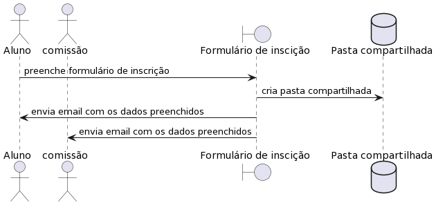
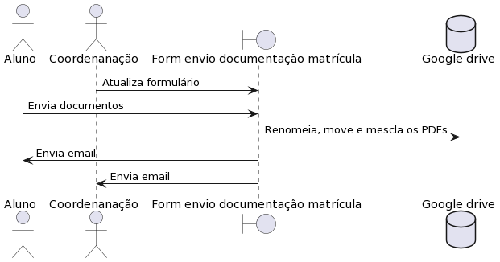
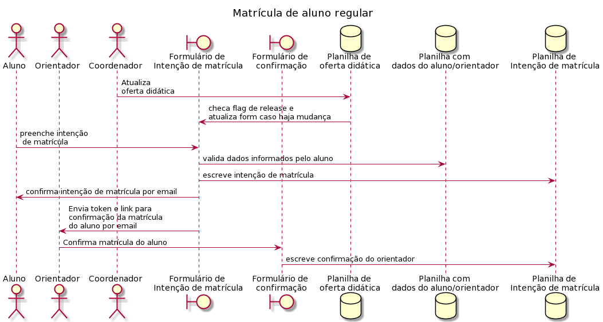

<!DOCTYPE html>
<html>
<h1 align="center" style="margin-right: -1.07cm; margin-bottom: 0cm">Automação de processos da pós-graduação</h1>

<ol>
	<li><h2 align="justify" style="margin-right: -1.07cm; margin-bottom: 0cm">
	Processo de inscrição de aluno regular e especial</h2>
	<ol>
		<li><h3 class="western" align="justify" style="margin-right: -1.07cm; margin-top: 0cm">
		Diagrama</h3>
	</ol>
</ol>

O Diagrama a seguir demonstra a sequência que o sistema segue para
que um aluno conclua sua inscrição: O aluno preenche o formulário
de inscrição, que a partir de um acionador, executa o script do
formulário que copia os dados enviados e armazena numa nova pasta
compartilhada com o aluno e a comissão. em seguida envia email para
o aluno e comissão com os dados do formulário.

 

O diagrama segue a seguinte lógica: se a seta sai de um módulo,
quer dizer que aquele módulo contém um script que está fazendo a
ação descrita na seta. Se sai de um ator, quer dizer que a ação
descrita na seta precisa ser feita manualmente pelo autor.

<ol>
	<ol start="2">
		<li><h3 class="western" align="justify" style="margin-right: -1.07cm">
		Planilhas necessárias</h3>
	</ol>
</ol>

A inscrição não requer nenhuma planilha, mas é possível gerar
uma planilha para manter o histórico de respostas a partir do
formulário.

<ol>
	<ol start="3">
		<li><h3 class="western" align="justify" style="margin-right: -1.07cm; margin-bottom: 0cm">
		Formulários necessários</h3>
		<ol>
			<li><h4 class="western" align="justify" style="margin-right: -1.07cm; margin-top: 0cm">
			Formulário de inscrição</h4>
		</ol>
	</ol>
</ol>

O formulário de inscrição irá coletar as informações e arquivos
enviados pelo aluno (Nome do aluno, endereço, email do aluno,
documentação enviada etc.). O formulário possui um script que é
acionado quando um usuário responde o formulário. O script irá
copiar os dados e documentos enviados, criar uma pasta onde
armazenará os documentos e enviará um email para o aluno e a
comissão com as informações contidas no formulário e pasta
compartilhada. Caso ocorra erro, um email será enviado para o
administrador com as informações do erro.

 

<ol>
	<ol start="4">
		<li><h3 class="western" align="justify" style="margin-right: -1.07cm">
		Relacionamento de scripts</h3>
	</ol>
</ol>

 

<ol>
	<ol>
		<ol>
			<li><h4 class="western" align="justify" style="margin-right: -1.07cm">
			Formulário de inscrição</h4>
		</ol>
	</ol>
</ol>

O script do formulário de inscrição deve ser acionado quando o
usuário responder o formulário.

 

O script irá copiar todas as respostas enviadas pelo aluno. Para as
respostas em texto, o script irá enviar por email para o aluno e
comissão. Para as respostas com envio de arquivo, o script irá
criar uma pasta nova com o nome e cpf do aluno, compartilhar essa
pasta com a comissão e aluno, e enviar o link da pasta junto com as
respostas de texto no email.

Neste script é preciso informar o ID da pasta onde serão
armazenadas todas as pastas compartilhadas com os alunos e o email da
comissão. A atribuição do ID e do email está logo abaixo do
cabeçalho do script.

 

 

<ol>
	<ol start="5">
		<li><h3 class="western" align="justify" style="margin-right: -1.07cm">
		Acionadores</h3>
	</ol>
</ol>

O formulário de inscrição precisa de um acionador que indique o
evento que inicia a execução do script, neste caso o evento de
enviar o formulário.

<ol>
	<ol start="6">
		<li><h3 class="western" align="justify" style="margin-right: -1.07cm">
		Informações adicionais</h3>
	</ol>
</ol>

Informações adicionais sobre o script e como ele funciona podem ser
obtidas através dos comentários de código descritos no próprio
script. Para que o script funcione de forma automática, é
necessário que seu ativador descrito nas seções anteriores esteja
funcionando, e que ele tenha permissão de ser executado pela conta
google do administrador. A forma mais fácil de fazer isso é
executar o script manualmente pelo menos uma vez, através da
interface do editor de scripts do Google.

 

<h2 align="justify" style="margin-left: -1cm; margin-right: -1.07cm">
 
 

</h2>

 

 

<ol start="2">
	<li><h2 align="justify" style="margin-right: -1.07cm; margin-bottom: 0cm">
	Processo de envio de documentação de matrícula de
	aluno regular e especial</h2>
	<ol>
		<li><h3 class="western" align="justify" style="margin-right: -1.07cm; margin-top: 0cm">
		Diagrama</h3>
	</ol>
</ol>

O Diagrama a seguir demonstra a sequência que o sistema segue para
que um aluno conclua sua inscrição:

O aluno preenche o formulário de envio de documentação, que a
partir de um acionador, executa o script do formulário que copia os
documentos enviados e armazena numa nova pasta compartilhada com o
aluno e a coordenação. em seguida envia email para o aluno e
coordenação com os dados do formulário.

 

O diagrama segue a seguinte lógica: se a seta sai de um módulo,
quer dizer que aquele módulo contém um script que está fazendo a
ação descrita na seta. Se sai de um ator, quer dizer que a ação
descrita na seta precisa ser feita manualmente pelo autor.

<ol>
	<ol start="2">
		<li><h3 class="western" align="justify" style="margin-right: -1.07cm">
		Planilhas necessárias</h3>
	</ol>
</ol>

O formulário de envio de documentação não requer nenhuma
planilha, mas é possível gerar uma planilha para manter o histórico
de respostas a partir do formulário.

<ol>
	<ol start="3">
		<li><h3 class="western" align="justify" style="margin-right: -1.07cm; margin-bottom: 0cm">
		Formulários necessários</h3>
		<ol>
			<li><h4 class="western" align="justify" style="margin-right: -1.07cm; margin-top: 0cm">
			Formulário de envio de documentação</h4>
		</ol>
	</ol>
</ol>

O formulário de envio de documentação irá coletar as informações
e arquivos enviados pelo aluno (Nome do aluno, cpf, email do aluno,
documentação enviada etc.). O formulário possui um script que é
acionado quando um usuário responde o formulário. O script irá
copiar os dados e documentos enviados, criar uma pasta onde
armazenará os documentos e enviará um email para o aluno e a
coordenação com as informações contidas no formulário e pasta
compartilhada. Caso ocorra erro, um email será enviado para o
administrador com as informações do erro.

 

<ol>
	<ol start="4">
		<li><h3 class="western" align="justify" style="margin-right: -1.07cm">
		Relacionamento de scripts</h3>
	</ol>
</ol>

 

<ol>
	<ol>
		<ol>
			<li><h4 class="western" align="justify" style="margin-right: -1.07cm">
			Formulário de envio de documentação</h4>
		</ol>
	</ol>
</ol>

O script do formulário de envio de documentação deve ser acionado
quando o usuário responder o formulário.

 

O script irá copiar todas as respostas enviadas pelo usuário. Para
as respostas em texto, o script irá enviar por email para o aluno e
coordenação. Para as respostas com envio de arquivo, o script irá
criar uma pasta nova com o nome e cpf do aluno, compartilhar essa
pasta com a comissão e aluno, e enviar o link da pasta junto com as
respostas de texto no email. Os PDFs enviados serão mesclados num
único PDF, com folhas de rosto para cada PDF que foi enviado pelo
aluno.

 

Neste script é preciso informar (no cabeçalho):

<ul>
	<li>

	Os IDs das pastas de aluno regular e especial onde serão criadas
	todas as pastas compartilhadas com os alunos e o email da
	coordenação.

	<li>

	O ID do documento de referência para a criação das folhas de
	rosto.

	<li>

	O ID de uma pasta qualquer onde o script irá guardar um arquivo
	temporário da folha de rosto.

	<li>

	O nome que o PDF final receberá (após a mesclagem).

	<li>

	O email da coordenação.

	<li>

	O semestre letivo.

</ul>

Observações:

<ul>
	<li>

	O script presume que a quarta questão (não incluindo a coleta do
	email) é sobre concorrência a vagas reservadas, e a primeira e
	segunda resposta dessa questão é, respectivamente, a inscrição
	para aluno especial e regular sem vagas reservadas. Caso haja
	mudança em alguma dessas ordens, é preciso modificar também a
	ordem no script(linhas 88 e 210).
	

	<li>

	Para a nomeação das pastas criadas o script coleta o nome e cpf (o
	script presume que seja a segunda e terceira questão,
	respectivamente. Não incluindo a coleta do email). Caso haja
	mudança na ordem dessas questões, é preciso modificar também a
	ordem no script (linhas 28 e 30).

</ul>

 

 

 

 

<ol>
	<ol start="5">
		<li><h3 class="western" align="justify" style="margin-right: -1.07cm">
		Acionadores</h3>
	</ol>
</ol>

O formulário de envio de documentação precisa de um acionador que
indique o evento que inicia a execução do script, neste caso o
evento de enviar o formulário.

<ol>
	<ol start="6">
		<li><h3 class="western" align="justify" style="margin-right: -1.07cm">
		Informações adicionais</h3>
	</ol>
</ol>

Informações adicionais sobre o script e como ele funciona podem ser
obtidas através dos comentários de código descritos no próprio
script. Para que o script funcione de forma automática, é
necessário que seu ativador descrito nas seções anteriores esteja
funcionando, e que ele tenha permissão de ser executado pela conta
google do administrador. A forma mais fácil de fazer isso é
executar o script manualmente pelo menos uma vez, através da
interface do editor de scripts do Google.

 

 

<h2 align="justify" style="margin-left: -1cm; margin-right: -1.07cm">
 
 

</h2>

 

 

<ol start="3">
	<li><h2 align="justify" style="margin-right: -1.07cm; margin-bottom: 0cm">
	Processo de matrícula</h2>
	<ol>
		<li><h3 class="western" align="justify" style="margin-right: -1.07cm; margin-top: 0cm">
		Diagrama</h3>
	</ol>
</ol>

O Diagrama a seguir demonstra a sequência que o sistema segue para
que um aluno conclua sua intenção de matrícula:

<ul>
	<li>

	O coordenador do curso atualiza a planilha de oferta didática com
	as disciplinas ofertadas e aciona o script que atualiza o formulário
	de intenção de matrícula.

	<li>

	O aluno responde o formulário de intenção de matrícula, que a
	partir de um acionador, executa o script do formulário que valida
	os dados informados pelo aluno com a planilha de orientação e
	escreve os dados da resposta do aluno na planilha de intenção de
	matrícula, incluindo data e hora da resposta, se a resposta
	continha erros ou não, e um token que representa a relação
	aluno/orientador.

	<li>

	O script do formulário de intenção de matrícula então enviar um
	email para o aluno atestando que a resposta foi registrada e também
	um email para o orientador com o token para que seja feita a
	confirmação da intenção.

	<li>

	O orientador responde o formulário de confirmação com o token
	informado por email, acionando o script do formulário de
	confirmação que escreve a confirmação do orientador da planilha
	de intenção de matrícula.

</ul>

 

O diagrama segue a seguinte lógica: se a seta sai de um módulo,
quer dizer que aquele módulo contém um script que está fazendo a
ação descrita na seta. Se sai de um ator, quer dizer que a ação
descrita na seta precisa ser feita manualmente pelo autor.

<ol>
	<ol start="2">
		<li><h3 class="western" align="justify" style="margin-right: -1.07cm; margin-bottom: 0cm">
		Planilhas necessárias</h3>
		<ol>
			<li><h4 class="western" align="justify" style="margin-right: -1.07cm; margin-top: 0cm">
			Planilha de oferta didática</h4>
		</ol>
	</ol>
</ol>

A planilha de oferta didática armazena dados referentes às
disciplinas ofertadas.

 

Na aba “horarioAnalitico”, deve-se escolher as disciplinas
ofertadas através da lista suspensa em cada linha na coluna B,
igualmente para os docentes na coluna P. As colunas de turma (coluna
E), vagas (coluna F) e as seções de horário 1 e 2 (colunas G a N)
deverão ser preenchidas manualmente. As colunas código da
disciplina (coluna A), natureza da disciplina (coluna C), carga
horária (coluna D), departamento do docente (O) e creditação (Q)
serão povoadas automaticamente baseadas nas escolhas das listas.

 

A aba “auxiliar” é onde ficam guardadas as informações das
disciplinas e orientadores e cada célula deverá ser povoada
manualmente.

 

As abas “DTEC” e “DEXA” serão povoadas automaticamente com
as linhas da aba “HorarioAnalitico” separando os departamentos.

 

Esta planilha possui um script interno que serve para atualizar
dinamicamente o formulário de intenção de matrícula com os dados
das planilhas de oferta didática e de orientação com base na
relação de orientadores a partir da planilha de orientação e na
relação de disciplinas a partir da planilha de oferta didática. O
script deve ser acionado através do botão ‘Atualizar’
encontrado na aba “HorarioAnalitico”.

 

 

<ol>
	<ol>
		<ol start="2">
			<li><h4 class="western" align="justify" style="margin-right: -1.07cm">
			Planilha de orientação</h4>
		</ol>
	</ol>
</ol>

A planilha de orientação contém a relação aluno/orientador(a)
com dados de matrícula (coluna A), nome do aluno (coluna B), email
do aluno (coluna C), nome do orientador (coluna D), email do
orientador (coluna E) e token que representa essa relação (coluna
F). O token é gerado por script e não deve ser editado manualmente.

<ol>
	<ol>
		<ol start="3">
			<li><h4 class="western" align="justify" style="margin-right: -1.07cm">
			Planilha de intenção de matrícula</h4>
		</ol>
	</ol>
</ol>

A planilha de intenção de matrícula () é onde ficam guardados
todos os dados informados pelo aluno na sua resposta do formulário
de intenção de matrícula (descrito na próxima seção). Sempre
que o formulário de intenção de matrícula recebe uma nova edição,
o script do formulário coleta os dados das respostas (matrícula,
email, nome, orientador e disciplinas) e escreve na planilha de
intenção de matrícula. Então envia email para o orientador e
aluno informando a intenção de matrícula, se as informações
estiverem corretas, ou um email de erro, caso haja inconsistências.
Em caso de edição do conteúdo submetido do formulário, irá
escrever uma nova linha na planilha, sem modificar a submissão
anterior. E além disso, também guarda a data e horário da
resposta, um status que diz se houve erro ou não na resposta, e o
token que representa a relação aluno/orientador.

Para que não haja erro nas buscas e comparações dos scripts, é
necessário que todas as colunas estejam formatadas para texto
simples.

A coluna F é preenchida com o script contido no formulário de
confirmação de matrícula descrito na seção de formulários.

<ol>
	<ol>
		<ol start="4">
			<li><h4 class="western" align="justify" style="margin-right: -1.07cm">
			Planilha de confirmação de matrícula</h4>
		</ol>
	</ol>
</ol>

A planilha de confirmação de matrícula servirá apenas de log para
cada vez que um orientador utilizar um token. Não possui script
interno.

<ol>
	<ol start="3">
		<li><h3 class="western" align="justify" style="margin-right: -1.07cm; margin-bottom: 0cm">
		Formulários necessários</h3>
		<ol>
			<li><h4 class="western" align="justify" style="margin-right: -1.07cm; margin-top: 0cm">
			Formulário de intenção de matrícula</h4>
		</ol>
	</ol>
</ol>

O formulário de intenção de matrícula irá coletar as informações
necessárias sobre disciplinas selecionadas pelo discente/orientador,
para que seja feita a matrícula do aluno (Nome do aluno, matrícula
do aluno, email do aluno, orientador e as disciplinas escolhidas). O
formulário possui um script que é acionado quando um usuário
responde o formulário. O script irá validar os dados informados e
enviar um email para o aluno com as respostas dadas e um email para
o(a) orientador(a) com informações para validação da matrícula
em casos de sucesso. Caso ocorra erro, um email único de erro será
enviado para ambas as partes.

<ol>
	<ol>
		<ol start="2">
			<li><h4 class="western" align="justify" style="margin-right: -1.07cm">
			Formulário de confirmação de matrícula</h4>
		</ol>
	</ol>
</ol>

O formulário de confirmação de matrícula irá confirmar a
intenção de matrícula do aluno ao ser respondido pelo orientador
com o token informado por email. O formulário possui um script
interno que serve para identificar o token informado no formulário,
e a partir dele:

<ul>
	<li>

	Encontra o aluno que o token representa.

	<li>

	Checa na planilha de orientação se o aluno e o orientador estão
	relacionados.

	<li>

	Escreve a confirmação do orientador na planilha de intenção de
	matrícula.

</ul>

 

O script então enviará email para o aluno e orientador nos casos de
sucesso e erro.

 

<ol>
	<ol start="4">
		<li><h3 class="western" align="justify" style="margin-right: -1.07cm">
		Relacionamento de scripts</h3>
	</ol>
</ol>

 

<ol>
	<ol>
		<ol>
			<li><h4 class="western" align="justify" style="margin-right: -1.07cm">
			Planilha de oferta</h4>
		</ol>
	</ol>
</ol>

O Script da planilha de oferta didática serve para formatar o
formulário de intenção de matrícula com os dados das planilhas de
oferta didática e de orientação. Ele é acionado pelo botão
“Atualizar” na planilha. Ao clicar no botão o script irá
verificar as caixas “Publicar?” e “Apagar respostas?” para
decidir se publica o formulário e/ou apaga as respostas.

 

O script irá checar as duas caixas de marcação “Publicar?” e
“Apagar respostas?”. Caso a caixa “Publicar?” esteja marcada,
o <i>script</i> irá atualizar o formulário com as mudanças feitas
na planilha e sinalizá-lo para que aceite novas respostas. Caso a
caixa “Publicar?” esteja desmarcada, o script irá atualizar o
formulário com as mudanças feitas na planilha e irá sinalizá-lo
para que não aceite novas respostas. Caso a caixa “Apagar
respostas?” esteja marcada, o script irá apagar todas respostas do
formulário e da planilha, caso contrário o conteúdo de ambos é
preservado.

 

Neste script é preciso informar os IDs das planilhas de orientação
e intenção de matrícula, e o ID do formulário de intenção de
matrícula. A atribuição dos IDs está logo abaixo do cabeçalho do
script, e cada ID é usado da seguinte forma:

<ul>
	<li>

	planilha de orientação

	<ul>
		<li>

		Usada para identificar os orientadores cadastrados e criar a
		questão de múltipla escolha no formulário.

	</ul>
	<li>

	planilha de intenção de matrícula

	<ul>
		<li>

		Usada para apagar as respostas, caso a caixa “apagar?” esteja
		marcada.

	</ul>
	<li>

	formulário de intenção de matrícula

	<ul>
		<li>

		Usado para atualizar o formulário com as informações da planilha
		de oferta e orientação.	

	</ul>
</ul>

 

<ol>
	<ol>
		<ol start="2">
			<li><h4 class="western" align="justify" style="margin-right: -1.07cm">
			Formulário de Intenção de matrícula</h4>
		</ol>
	</ol>
</ol>

O script do formulário de intenção de matrícula deve ser acionado
quando o usuário responder o formulário.

 

O script irá validar os dados informados pelo aluno comparando
matrícula, orientador e email informados no formulário com os dados
correspondentes que estão salvos na planilha de orientação. Em
caso de sucesso, irá enviar email informando o aluno e orientador
que a intenção de matrícula foi feita, junto com o token que o
orientador irá usar para confirmar a intenção. Em caso de erro,
irá enviar email para o aluno informando se a matrícula ou o email
não foi encontrado na planilha de orientação, ou o orientador
informado não é o mesmo orientador vinculado com o aluno indicado
pela matrícula informada. O token criado pelo script que é enviado
ao orientador é gerado com uma função que tem como entrada a
matrícula, data e hora da resposta ao formulário, e um hash md5
como saída. Então irá escrever esse token na planilha de intenção
de matrícula na nova linha criada pela resposta ao formulário, e na
planilha de orientação na linha correspondente à relação
aluno/orientador informado (substituindo algum token previamente
escrito).

Neste script é preciso informar os IDs das planilhas de intenção
de matrícula e de orientação. A atribuição dos IDs está logo
abaixo do cabeçalho do script, e cada ID é usado da seguinte forma:

 

<ul>
	<li>

	Planilha de intenção de matrícula

	<ul>
		<li>

		Usada para escrever a resposta do aluno na planilha.

	</ul>
	<li>

	Planilha de orientação

	<ul>
		<li>

		usada para verificar se os dados informados pelo aluno no
		formulário são válidos.

	</ul>
</ul>
<ol>
	<ol>
		<ol start="3">
			<li><h4 class="western" align="justify" style="margin-right: -1.07cm; margin-top: 0cm">
			Formulário de Confirmação de matrícula</h4>
		</ol>
	</ol>
</ol>

O script do formulário de confirmação de matrícula recebe o token
informado no formulário, e a partir dele:

<ul>
	<li>

	Encontra o aluno com este token associado na planilha de
	orientação;.

	<li>

	Identifica a relação aluno/orientador na planilha de orientação
	a partir do token informado;

	<li>

	Coleta o nome e email do aluno, nome e email do orientador,
	necessários para enviar email.

	<li>

	Encontra a intenção de matrícula do aluno na planilha de intenção
	de matrícula a partir do token informado.

	<li>

	Escreve a confirmação do orientador na planilha de intenção de
	matrícula.

	<li>

	Envia email para aluno e orientador (endereços obtidos na planilha
	de orientação) confirmando a intenção de matrícula, com
	descrição das disciplinas escolhidas.

</ul>

 

Caso a intenção de matrícula do aluno não seja encontrada na
planilha de intenção de matrícula (token não encontrado), o
script enviará um email para o orientador (endereço fornecido no
formulário) informando que entrem em contato com a coordenação do
PGCC.

 

Neste script é preciso informar os IDs das planilhas de intenção
de matrícula e de orientação. A atribuição dos IDs está logo
abaixo do cabeçalho do script, e cada ID é usado da seguinte forma:

 

<ul>
	<li>

	Planilha de intenção de matrícula

	<ul>
		<li>

		Utilizada para escrever a confirmação do orientador na planilha
		de intenção.

	</ul>
	<li>

	Planilha de orientação

	<ul>
		<li>

		Utilizada para validar o token informado pelo orientador e coletar
		os dados usados para enviar o email.

	</ul>
</ul>

 

 

<ol>
	<ol start="5">
		<li><h3 class="western" align="justify" style="margin-right: -1.07cm">
		Acionadores</h3>
	</ol>
</ol>

Tanto o script do formulário de intenção de matrícula, quanto o
script do formulário de confirmação de matrícula precisam de
acionadores que indicam o evento que inicia a execução do script,
neste caso o evento de enviar o formulário.

<ol>
	<ol start="6">
		<li><h3 class="western" align="justify" style="margin-right: -1.07cm">
		Informações adicionais</h3>
	</ol>
</ol>

Informações adicionais sobre os scripts e como eles funcionam podem
ser obtidas através dos comentários de código descritos nos
próprios scripts. Para que os scripts funcionem de forma automática,
é necessário que seus ativadores descritos nas seções anteriores
estejam funcionando, e que eles tenham permissão de serem executados
pela conta google do administrador. A forma mais fácil de fazer isso
é executar cada script manualmente pelo menos uma vez, através da
interface do editor de scripts do Google.

 

</body>
</html>
